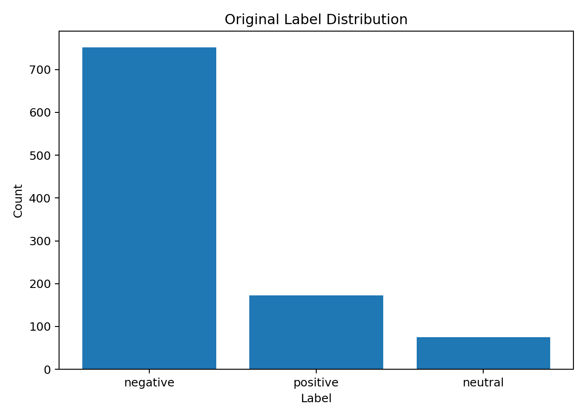
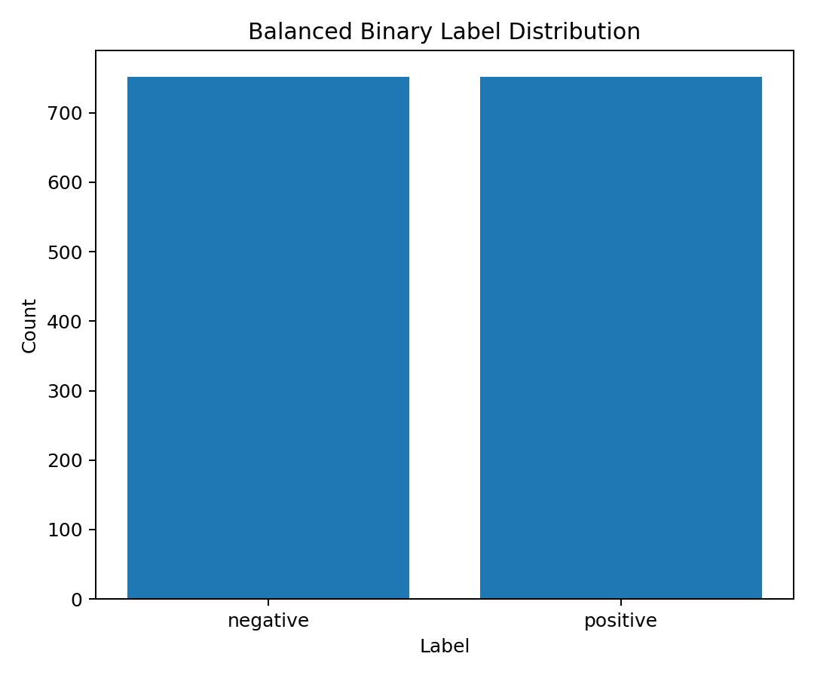
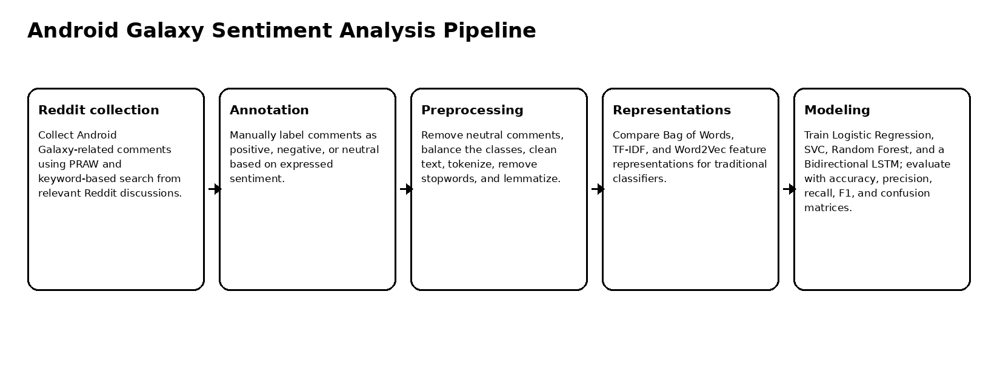
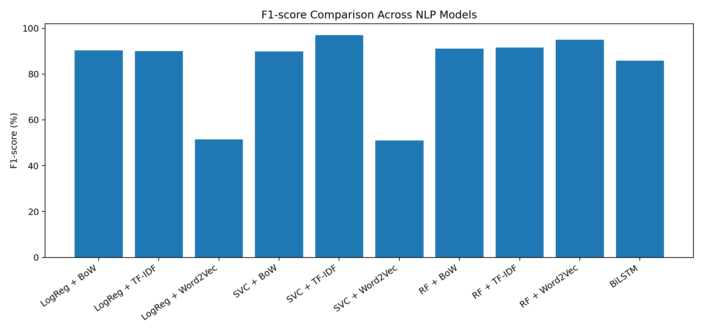
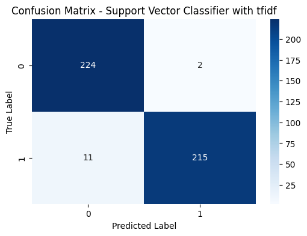
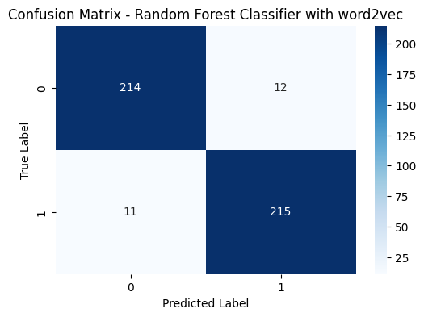
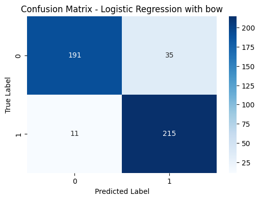
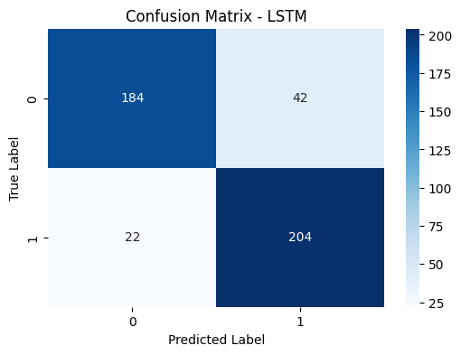

# Android Galaxy Sentiment Analysis with NLP

End-to-end NLP pipeline for sentiment classification of Android Galaxy-related Reddit comments using traditional machine learning, text representations, and a Bidirectional LSTM model.

## Overview

This project analyzes user sentiment toward Android Galaxy products using Reddit comments. The goal is to classify comments as **positive** or **negative** and compare how different NLP representations and models perform on the same manually labeled dataset.

The project compares:

- Logistic Regression
- Support Vector Classifier
- Random Forest
- Bidirectional LSTM

It also compares multiple text representations:

- Bag of Words
- TF-IDF
- Word2Vec
- Neural embedding layer for LSTM

The best-performing traditional model was **SVC with TF-IDF**, achieving **97.12% accuracy** and **97.07% F1-score**.

## Dataset

| Item | Value |
|---|---:|
| Source | Reddit comments |
| Topic | Android Galaxy / Samsung Galaxy S25 discussions |
| Raw comments | 1,000 |
| Original labels | positive, negative, neutral |
| Negative comments | 752 |
| Positive comments | 173 |
| Neutral comments | 75 |
| Binary task | positive vs. negative |
| Balancing method | Positive-class upsampling |
| Balanced dataset | 752 positive / 752 negative |

Neutral comments were removed to focus on binary sentiment classification. Because the positive class was much smaller than the negative class, upsampling was used to balance the dataset before model training.

## Original Label Distribution



## Balanced Binary Label Distribution



## NLP Pipeline



## Text Preprocessing

The preprocessing workflow includes:

- HTML tag removal
- Lowercasing
- Tokenization with NLTK
- Stopword removal
- Lemmatization with WordNet
- Neutral-label removal
- Class balancing by upsampling the positive class

The cleaned text is then passed into traditional vectorizers or into the LSTM tokenizer.

## Model Results

| Model | Representation | Accuracy | Precision | Recall | F1-score |
|---|---|---:|---:|---:|---:|
| Logistic Regression | BoW | 89.82% | 86.00% | 95.13% | 90.34% |
| Logistic Regression | TF-IDF | 89.82% | 87.82% | 92.48% | 90.09% |
| Logistic Regression | Word2Vec | 48.23% | 48.44% | 54.87% | 51.45% |
| SVC | BoW | 89.16% | 84.17% | 96.46% | 89.90% |
| SVC | TF-IDF | 97.12% | 99.08% | 95.13% | 97.07% |
| SVC | Word2Vec | 47.79% | 48.05% | 54.42% | 51.04% |
| Random Forest | BoW | 90.49% | 85.88% | 96.90% | 91.06% |
| Random Forest | TF-IDF | 91.15% | 86.90% | 96.90% | 91.63% |
| Random Forest | Word2Vec | 94.91% | 94.71% | 95.13% | 94.92% |
| BiLSTM | Embedding | 85.84% | 86.13% | 85.85% | 85.82% |

## F1-Score Comparison



## Confusion Matrices

| SVC + TF-IDF | Random Forest + Word2Vec |
|---|---|
|  |  |

| Logistic Regression + BoW | LSTM |
|---|---|
|  |  |

## LSTM Model

The LSTM model uses:

- Tokenizer with fixed vocabulary size
- Sequence padding
- Embedding layer
- Bidirectional LSTM
- Dropout
- Dense classification layers

LSTM reached **85.84% overall accuracy**. It showed balanced class-level behavior, with positive-class recall of **90.27%** and negative-class F1-score of **85.19%**.

## Key Findings

1. TF-IDF was the strongest representation for SVC.
2. SVC + TF-IDF achieved the best overall performance with 97.07% F1-score.
3. Random Forest + Word2Vec performed strongly, reaching 94.92% F1-score.
4. Simple Word2Vec averaging performed poorly with Logistic Regression and SVC, showing that embeddings need suitable modeling choices.
5. LSTM performed competitively but did not outperform the best traditional model on this dataset.
6. Careful preprocessing and balancing were important because the raw dataset was highly skewed toward negative comments.

## Repository Structure

```text
.
├── android_galaxy_sentiment_analysis.ipynb
├── src/
│   ├── collect_reddit_comments.py
│   ├── preprocessing.py
│   ├── train_lstm.py
│   └── train_traditional.py
├── docs/
│   └── figures/
├── results/
│   ├── dataset_summary.json
│   └── model_comparison.csv
├── requirements.txt
├── .gitignore
└── README.md
```

## Run Locally

Create a Python environment and install dependencies.

### Windows PowerShell

```powershell
py -3.10 -m venv .venv
.\.venv\Scripts\Activate.ps1
python -m pip install --upgrade pip
pip install -r requirements.txt
```

### Linux / macOS

```bash
python3 -m venv .venv
source .venv/bin/activate
python -m pip install --upgrade pip
pip install -r requirements.txt
```

## Dataset Setup

Place the dataset at:

```text
data/android_galaxy_comments.csv
```

Expected columns:

```text
comment_text,label
```

The raw Reddit dataset is not included in this repository.

## Open the Notebook

```bash
jupyter notebook android_galaxy_sentiment_analysis.ipynb
```

## Optional Script Usage

Train traditional models:

```bash
python src/train_traditional.py --data data/android_galaxy_comments.csv --output outputs/traditional_results.csv
```

Train the LSTM model:

```bash
python src/train_lstm.py --data data/android_galaxy_comments.csv --epochs 10
```

Collect new Reddit comments:

```bash
export REDDIT_CLIENT_ID="..."
export REDDIT_API_SECRET="..."
python src/collect_reddit_comments.py --query "Galaxy S25 OR Samsung S25" --subreddit Android
```

## Limitations

The dataset is manually labeled and topic-specific, so the results may not generalize to other products, platforms, or languages. Upsampling balances the classes but can duplicate positive samples. Future work should test larger multilingual datasets, use pre-trained contextual embeddings, and add model explainability with SHAP or LIME.

## Future Work

Future improvements include using transformer-based models, multilingual sentiment analysis, domain adaptation for other product categories, richer annotation guidelines, and explainability tools for reviewing influential words and phrases.
